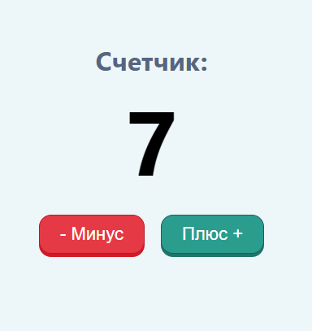
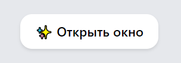
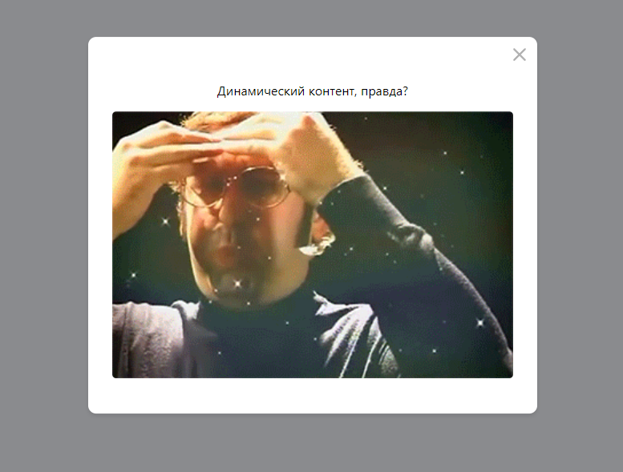
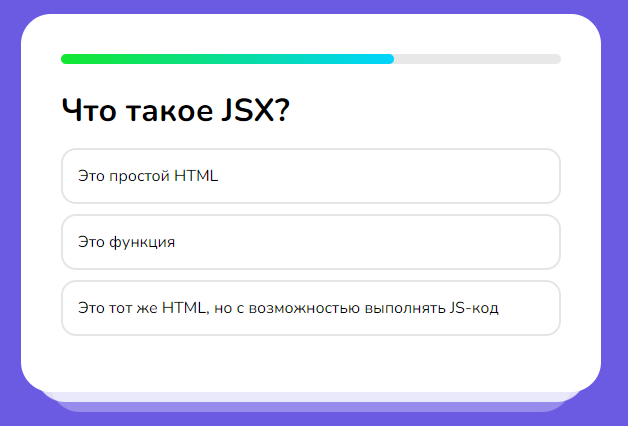
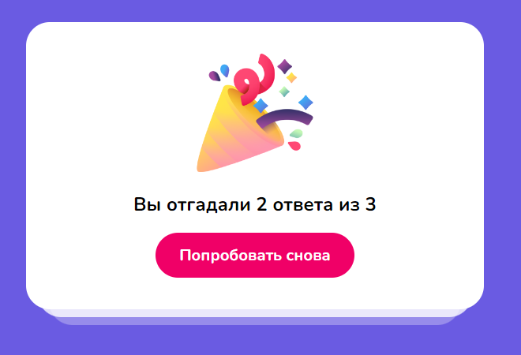

# mini-projects-react
Мини проекты по React для изучения основ библиотеки (смотреть ветки) + установить зависимости NPM!
Это мои первые шаги в изучении React. Спасибо за внимание!
# 1. Счётчик

# 2. Модальное окно

# 3. Мини-викторина

